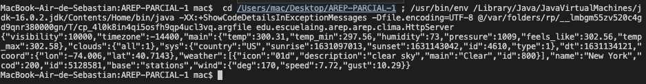

# AREP-PARCIAL1

> Su compañía lo ha seleccionado para construir una aplicación web simple desplegada en Heroku para uno de los clientes más importantes.
La aplicación debe consultar el estado del clima en lugares específicos de la tierra.  La aplicación recibirá en un campo la descripción de una ciudad, por ejemplo “London” para Londres   y deberá mostrar la información del clima para esa ciudad. Para esto utilice el API gratuito de https://openweathermap.org/ (Puede crear una cuenta para obtener la llave para realizar consultas). La petición debe pasar por su servicio web desplegado en Heroku, es decir desde su servicio en Heroku se debe invocar el servicio web de clima. El usuario no sabrá qué servicio está usted invocando por detrás. Utilice el servicio "Current Weather Data" de openweathermap.org.

>Debe usar sockets solamente no puede usar ni spark ni spring. Usted debe implementar al menos dos servicios web, uno que retorne la página (La página debe estár quemada en el código) y otro que retorne le Json con los datos del clima.

>La página debe invocar el servicio web de la ciudad de manera asíncrona y modificar la información directamente.

>El API de la página debe ser el siguiente:
{url del servicio en heroku}/clima

>El API de su servicio debe ser el siguiente:
{url del servicio en heroku}/consulta?lugar={ciudad o lugar}

>El servicio debe reornar un Json exactamente igual al que retorna el servicio de openweathermap denominado "Current Weather Data". Asegurese que el tipo de retorno sea Json.

>Sugerencia realice la implementación de manera incremental. Haga commits regulares.

>Entregue todo en GIT HUB y el enlace a Heroku.

### Pre-requisitos

> Para  elaborar este proyecto requeimos de dos tecnologias:
> * [Maven](https://es.wikipedia.org/wiki/Maven): Herramienta la cual permite realizar la construción de proyectos, realizarles pruebas y otras funciones.
> * [Git](https://es.wikipedia.org/wiki/Git): Software de control de versionamiento centralizado.

## Construido con

* [Maven](https://maven.apache.org/): Herramienta que se encarga de estandarizar la estructura física de los proyectos de software, maneja dependencias (librerías) automáticamente desde repositorios y administra el flujo de vida de construcción de un software.
* [GIT](https://git-scm.com/): Sistema de control de versiones que almacena cambios sobre un archivo o un conjunto de archivos, permite recuperar versiones previas de esos archivos y permite otras cosas como el manejo de ramas (branches).
* [Java](https://www.oracle.com/java/): Lenguaje de programación de propósito general, es decir, que sirve para muchas cosas, para web, servidores, aplicaciones móviles, entre otros. Java también es un lenguaje orientado a objetos, y con un fuerte tipado de variables.

## Prueba Consola

## Heroku
https://parcial-1-mina.herokuapp.com/

## Autor 

[Sebastián Mina](https://github.com/sebastianmina)

## Licencia & Derechos de Autor
**©** Sebastián Mina, Estudiante de Ingeniería de Sistemas de la Escuela Colombiana de Ingeniería Julio Garavito

Licencia bajo la [GNU General Public License](https://github.com/sebastianmina/AREP-TALLER-CLIENTES-Y-SERVICIOS/blob/main/LICENSE.txt).
